# 📦 Inventory Management System using Laravel
A modern and efficient **Inventory Management System** built with **Laravel** to streamline stock management, sales tracking, and invoicing with user authentications.

## 🚀 Features
### 🛡 Authentication & Security
- **User Registration & Login**
- **OTP Verification Password Change & Reset**
- **JWT Token-Based Authentication**
- **Session Management & Middleware Authentication**

### 📊 Dashboard
- Overview of Customer, Category, and product stock
- Overview of sales, revenue, and vat collection


### 📁 Inventory Management
- **Category Management**: Add, edit, delete product categories
- **Product Management**: Add, update, delete products with stock tracking
- **Customer Management**: Store customer information and purchase history

### 💰 Sales & Invoices
- **Sales Management**: Track real-time sales transactions
- **Invoice Generation**: Create & manage invoices for customers
- **Reports**: View sales & stock reports

### 📱 Responsive Design
- Fully **responsive** for desktop, tablet, and mobile devices

## 🖥 Screenshots
### 📸 Login Page
<p align="center">
    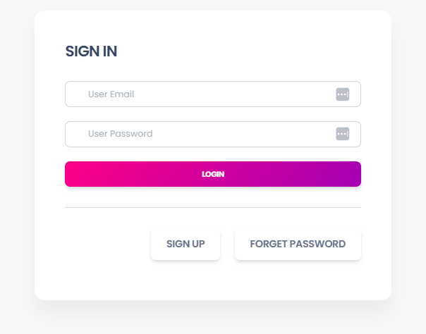
    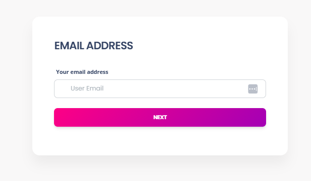
    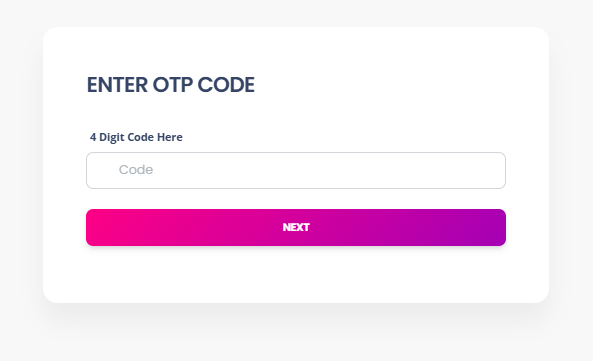
</p>

<p align="center">
    
    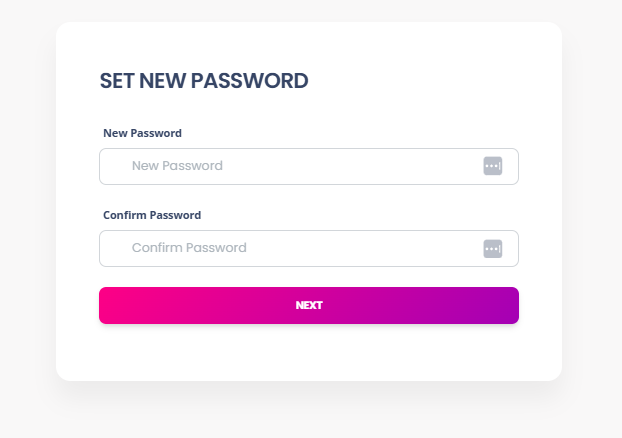
</p>

### 📸 Dashboard
<p align="center">
    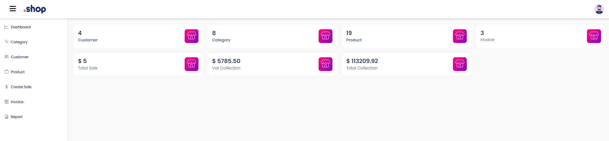
    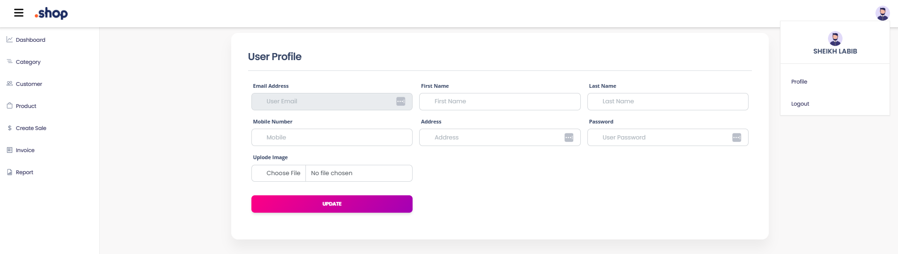
</p>


### 📸 Category Management
<p align="center">
    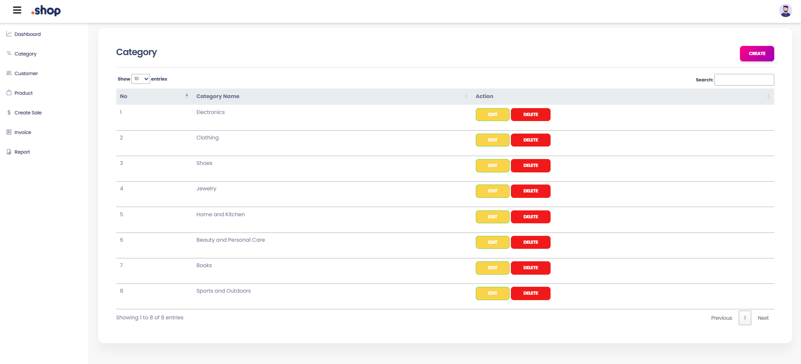
    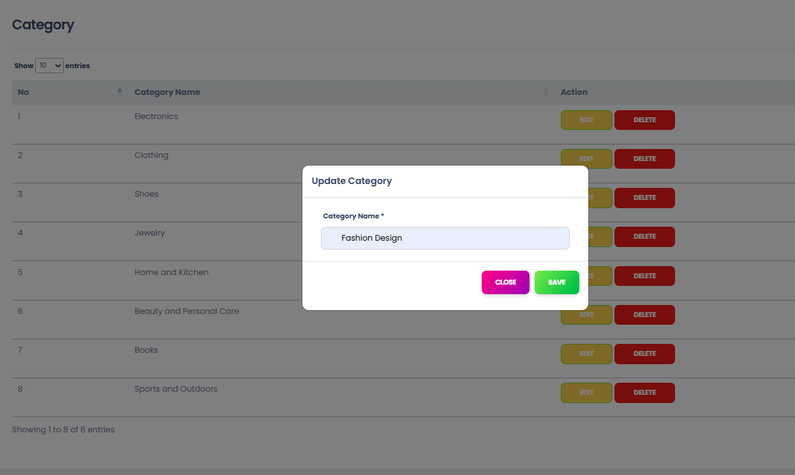
    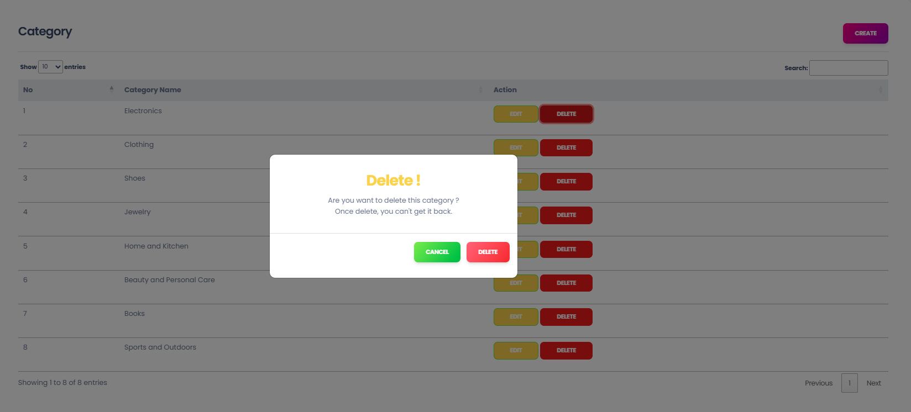
</p>
### 📸 Customer Management
<p align="center">
    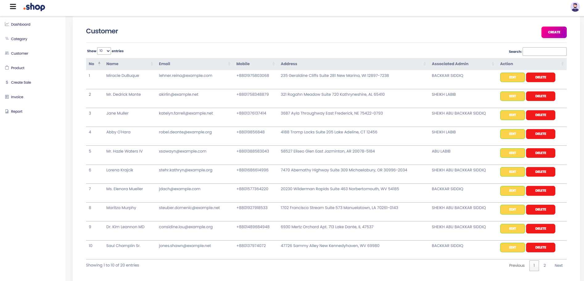
    
</p>

### 📸 Product Management
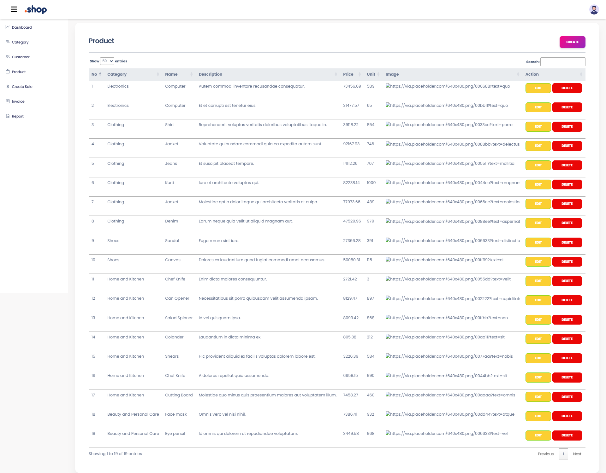
### 📸 Sales Management
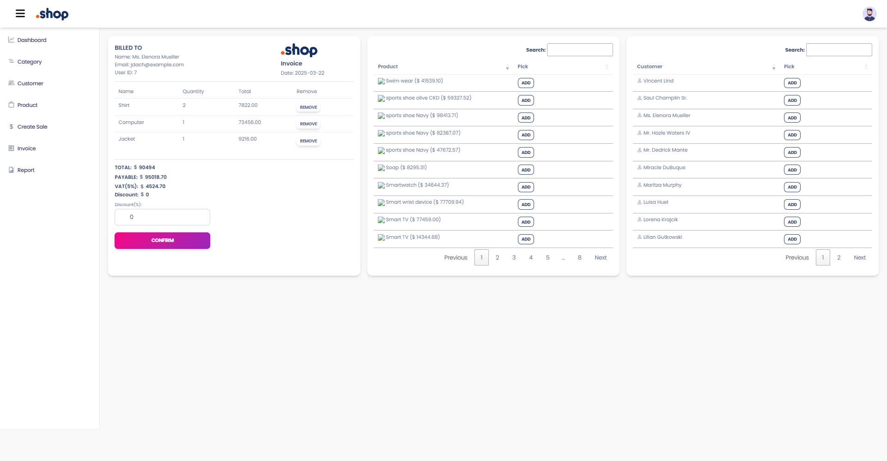

### 📸 Sales Report Generation
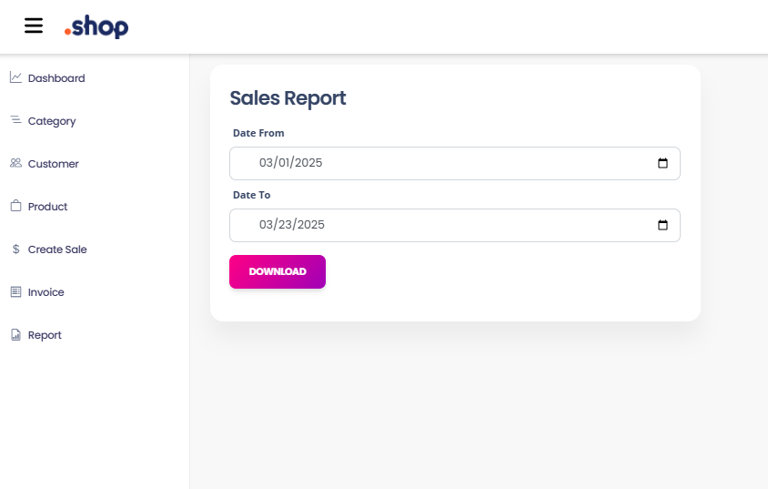
### invoice.pdf
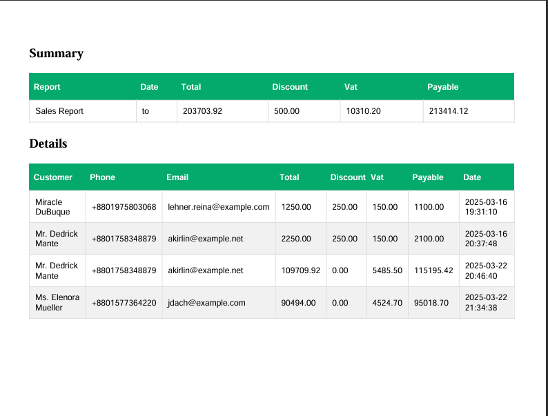

## 🛠 Installation Guide
### 📌 Prerequisites
- PHP 8.x  
- Composer  
- Laravel 10.x  
- MySQL  
- Node.js & NPM  

### 💡 Setup Instructions
1️⃣ Clone the repository:  
```bash
git clone https://github.com/labib108/Shop-Management-System.git
cd Shop-Management-System
```
2️⃣ Install dependencies:  
```bash
composer install
npm install && npm run dev
```
3️⃣ Configure `.env` file:  
```bash
cp .env.example .env
php artisan key:generate
```
4️⃣ Set up database and migrate:  
```bash
php artisan migrate --seed
```
5️⃣ Start the development server:  
```bash
php artisan serve
```
Now, visit **http://127.0.0.1:8000** to access the system.


## 🛠 Technologies Used
- **Backend**: Laravel, MySQL, JWT Authentication  
- **Frontend**: Blade, Bootstrap, JavaScript  
- **Security**: Middleware authentication, CSRF protection  
